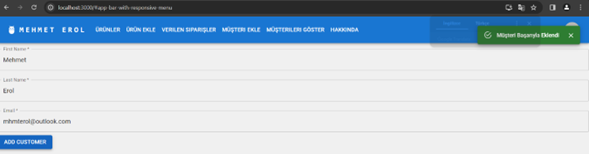
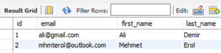
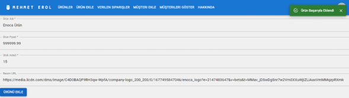
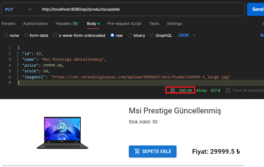
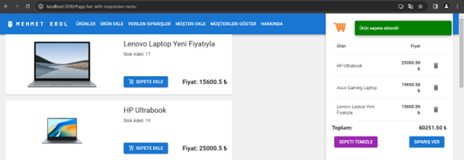
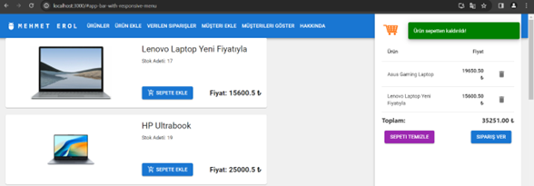
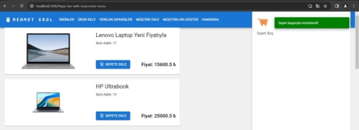
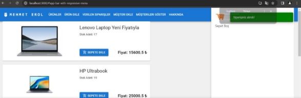
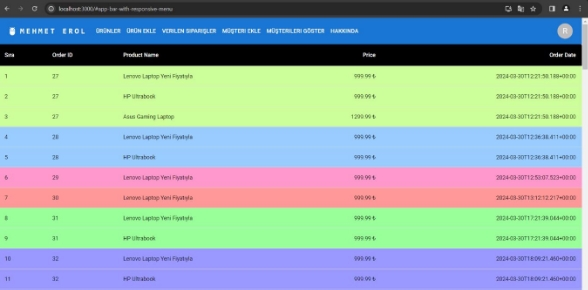
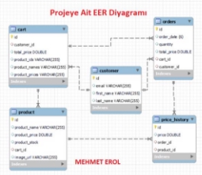

**İstek : Bir Alışveriş Projesi Yapılması Süre: 5 Gün** 

**Kullanılan Teknolojiler:   **

- Java  
- Java Spring  
- Hibernate  
- REST API  
- Mysql WorkBench  
- React  
- HTML  
- CSS  
- JavaScript  

**Proje Tanıtımı:**   Kullanılan Endpointler ve ne işe yaradıkları: 

CartController.java: 

/carts/create/{customerId}: Belirli bir müşteri için yeni bir sepet oluşturan endpoint. /carts/{id}: Belirli bir sepeti ID'ye göre getiren endpoint. 

/carts/update: Sepeti güncelleyen endpoint. 

/carts/{cartId}/products/{productId}: Sepete ürün ekleyen endpoint. /carts/{cartId}/products/{productId}: Sepetten ürün çıkaran endpoint. /carts/{id}/empty: Sepeti boşaltan endpoint. 

CustomerController.java: 

/customers/add: Yeni bir müşteri ekleyen endpoint. /customers/{id}: Belirli bir müşteriyi ID'ye göre getiren endpoint. /customers/all: Tüm müşterileri getiren endpoint. 

OrderController.java: 

/orders/place: Yeni bir sipariş oluşturan endpoint. 

/orders/{id}: Belirli bir siparişi ID'ye göre getiren endpoint. 

/orders/all: Tüm siparişleri getiren endpoint. 

/orders/customer/{customerId}: Belirli bir müşteriye ait siparişleri getiren endpoint. /orders/from-cart/{cartId}: Bir sepetten sipariş oluşturan endpoint. 

PriceHistoryController.java: 

/price-history/product/{productId}: Belirli bir ürün için fiyat geçmişini getiren endpoint. /price-history/add: Yeni bir fiyat geçmişi ekleyen endpoint. /price-history/order/{orderId}: Belirli bir sipariş için fiyat geçmişini getiren endpoint. /price-history/orders: Belirli sipariş ID'leri için fiyat geçmişlerini getiren endpoint. 

ProductController.java: 

/api/products/create: Yeni bir ürün oluşturan endpoint. /api/products/{id}: Belirli bir ürün ID'sine sahip ürünü getiren endpoint. /api/products/all: Tüm ürünleri getiren endpoint. 

/api/products/update: Ürünü güncelleyen endpoint. 

/api/products/{id}: Belirli bir ürün ID'sine sahip ürünü silen endpoint. 

1) Öncelikle bir Customer oluşturalım: 

Uygulamamızda “Müşteri Ekle” Sekmesinde POST isteği ile[ http://localhost:8080/customers/add ](http://localhost:8080/customers/add)endpointini kullanarak bir Customer oluştuduk. 

Databaseden kontrol edelim; 

2) Ürün Ekleme işlemlerini gerçekleştirelim: 

Postmanden istek oluşturmak yerine, Reactta oluşturmuş olduğum “Ürün Ekle” frontend tarafından ürün ekleme işlemini gerçekleştirelim. 

3) Ürünün “Ürünler” sekmesine geçip eklenip eklenmediğini kontrol edelim. 

4) Postman üzerinden bir ürün güncelleyelim ve silelim: 

Postmanden[ http://localhost:8080/api/products/update ](http://localhost:8080/api/products/update)endpointini kullanarak bir ürünü güncelleme işlemi gerçekleştirdim ve http://localhost:8080/api/products/{id} endpointi ile silme işlemi gerçekleştirebiliriz.  

5) Sepete Ürün Ekleme ve Sepetten Ürün Çıkarma işlemler:  

Sepete ürün eklerken[ http://localhost:3000/carts/{cartId}/products/{productId} ](http://localhost:3000/carts/%7bcartId%7d/products/%7bproductId%7d)endpoinitini ve addProductToCart methodunu kullanarak ürün ekleme işlemini gerçekleştiririz.  

Sepetten ürün çıkartma işlemi için yine[ http://localhost:3000/carts/{cartId}/products/{productId} ](http://localhost:3000/carts/%7bcartId%7d/products/%7bproductId%7d)endpoinitini kullanırız. Ürün çıkartmak için kullanıdığımız method ismi ise removeProductFromCart methodudur. 

6) Sepeti tamamen temizleme: 

“Sepeti Temizle” butonuna tıkladığımızda[ http://localhost:3000/carts/{id}/empty ](http://localhost:3000/carts/%7bid%7d/empty)endpointini ve emptyCart methodunu kullanarak sepeti tamamen boşaltırız. 

7) Sipariş verme işlemi: 

“Sipariş Ver” butonuna tıkladığımızda[ http://localhost:3000/orders/from-cart/{cartId} ](http://localhost:3000/orders/from-cart/%7bcartId%7d)endpoinitini ve placeOrderFromCart methodunu kullanarak sepetteki tüm ürünler sipariş olarak geçilir.  

8) Verilen Siparişleri Görme: 

Verilen siparişleri görmek için[ http://localhost:3000/price-history/orders ](http://localhost:3000/price-history/orders)endpointi kullanılarak erişilir. Uygulamamızda ise “Verilen Siparişler” sekmesinde görebiliriz. Aynı sipariş numarasına ait olan siparişler aynı renklerde boyanmıştır.  

Mehmet Erol – Mart 2024 

